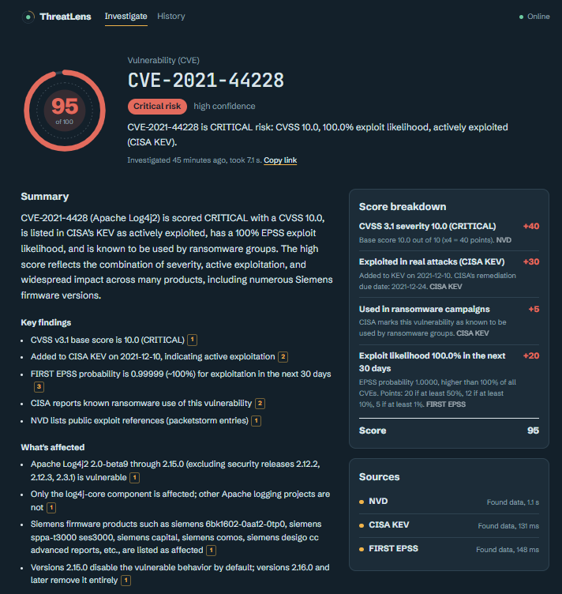

# ThreatLens

**See the threat before it sees you.**

ThreatLens is an AI threat intelligence agent for security analysts. Enter a CVE, IP address, domain, or file hash, and it checks trusted intelligence sources at the same time, scores the risk with a formula you can inspect, explains what to do with a source behind every claim, and shows every decision it made along the way.

**Live: [threatlens-xi.vercel.app](https://threatlens-xi.vercel.app)** · **API docs: [threatlens-api-fyjy.onrender.com/docs](https://threatlens-api-fyjy.onrender.com/docs)**

> The backend runs on a free plan and sleeps when idle, so the first investigation can take up to a minute. The example investigations on the home page open instantly.



## Why it exists

Investigating one indicator normally means opening six browser tabs: NVD for the vulnerability, CISA KEV for real-world exploitation, VirusTotal and AbuseIPDB for reputation, a threat feed for context, then writing it all up. ThreatLens does that in a few seconds and shows its work.

## What it does

- **Understands messy input.** CVEs, IPv4/IPv6 (with ports), domains (including international names), MD5/SHA-1/SHA-256 hashes, URLs, and defanged text like `hxxps://evil[.]com`.
- **Checks up to five sources at once.** NVD, CISA KEV, FIRST EPSS, AbuseIPDB, VirusTotal, AlienVault OTX, ThreatFox, URLhaus, and MalwareBazaar. A source that fails, times out, or hits its rate limit never stops the investigation; it lowers the reported confidence instead.
- **Scores risk transparently.** Every point comes from a named signal with its evidence and source. Agreement between independent sources raises the score; evidence older than a year lowers it.
- **Explains with citations.** An AI writes the summary, findings, and next steps from the collected evidence only. Each statement links to the source it came from.
- **Shows its reasoning.** A step-by-step trail of what was checked, what was decided, and why.
- **Avoids false alarms.** Known-good services score lower, without hiding any evidence.
- **Remembers.** Investigations are saved and shareable by link; source answers and AI reports are cached to protect free API limits.

## Architecture

```
Browser ──▶ React frontend (Vercel) ──▶ FastAPI backend (Render, Docker) ──▶ PostgreSQL + pgvector (Neon)
                                              │
                                              ├──▶ Intelligence sources (NVD, CISA KEV, EPSS, AbuseIPDB,
                                              │     VirusTotal, OTX, ThreatFox, URLhaus, MalwareBazaar)
                                              └──▶ AI report writer (Groq, with Gemini as backup)
```

One investigation: **detect input → known-good check → choose sources → query them in parallel → score → AI explanation → save**, recording a trace step for every decision.

## Design decisions

| Decision | Why |
|---|---|
| **The score is a formula, not the AI's opinion** | Same evidence always gives the same score, and every point is traceable. The AI explains the score; it never sets it. |
| **The AI can only use the evidence given to it** | No facts from model memory. Statements citing no real source are removed before display, and the count is shown. |
| **Links never come from the AI** | Any URL the model writes is stripped. Source links come from ThreatLens's own data, so a manipulated model can't inject a link. |
| **Source text is untrusted input** | Threat data can contain text written by attackers, so it's passed as quoted data with explicit instructions not to follow it. The score is unaffected either way, since the formula doesn't read free text. |
| **Two AI providers, order configurable** | Free tiers are unreliable. Measured reliability decides which goes first (`AI_PROVIDER_ORDER`); the other takes over automatically. |
| **"All sources failed" is UNKNOWN, not LOW** | A failure must never look like a clean result. |
| **Private and reserved IPs are never sent to third parties** | Internal addresses have no public reputation, and sending them out could leak information about a network. |
| **Shared hosting platforms are never "known good"** | Anyone can publish on `github.io` or `pages.dev`, so a trusted parent domain doesn't make a subdomain safe. |
| **PostgreSQL with pgvector instead of a separate vector database** | One database for structured data and, in the next phase, semantic search. Less infrastructure, no extra cost. |
| **Results cached, failures not** | Repeated lookups cost no API quota, while a rate-limited source is retried next time. |

## Safety

- **Passive only.** ThreatLens queries intelligence databases *about* an indicator. It never connects to, scans, or resolves the indicator itself.
- **No malware handling.** Hashes and metadata only, never samples.
- **Usage limits.** Per-visitor and daily caps protect the free tiers. When the AI limit is reached, investigations still run and saved summaries are still served.

## Run it locally

Needs Python 3.14 (64-bit), Node 20.19+, and a PostgreSQL database (Neon's free tier works).

```bash
# Backend
cd backend
python -m venv .venv
.venv\Scripts\Activate.ps1          # macOS/Linux: source .venv/bin/activate
pip install -r requirements-dev.txt
cp .env.example .env                 # then fill in DATABASE_URL and API keys
python -m pytest                     # 102 tests
uvicorn app.main:app --reload

# Frontend (second terminal)
cd frontend
npm install
cp .env.example .env.local
npm run dev
```

Helper scripts, run from `backend/`:

| Script | What it does |
|---|---|
| `python -m scripts.check_keys` | Tests every API key with one small request |
| `python -m scripts.check_gemini_models` | Shows which Gemini models your key can actually use |
| `python -m scripts.try_investigation <input>` | Runs a full investigation in the terminal |
| `python -m scripts.seed_examples` | Fills the home page's example investigations |

All free-tier keys: [NVD](https://nvd.nist.gov/developers/request-an-api-key), [AbuseIPDB](https://www.abuseipdb.com), [OTX](https://otx.alienvault.com), [VirusTotal](https://www.virustotal.com), [abuse.ch](https://auth.abuse.ch), [Google AI Studio](https://aistudio.google.com), [Groq](https://console.groq.com).

## Tech

Python · FastAPI · PostgreSQL + pgvector (Neon) · Docker · React + Vite · Groq and Gemini APIs · pytest · Render + Vercel

## Known limitations

- **Scoring weights are informed judgments, not measured.** The evaluation set in the next phase will tune them against known answers.
- **Free-tier limits.** VirusTotal allows a few requests per minute, so it sometimes reports a rate limit; the investigation continues without it.
- **No accounts yet.** All investigations are visible to anyone with the link.
- **VirusTotal's free API and Vercel's Hobby plan are non-commercial**, which suits a portfolio project.

## Roadmap

- [x] **MVP**: investigations, explainable scoring, decision trail, AI reports with citations, live deployment
- [ ] **Phase 2**: research agent that decides its own next step, live decision graph, knowledge base for malware and campaign queries, MITRE ATT&CK mapping, bulk IOC lookup, STIX 2.1 export
- [ ] **Phase 3**: accounts, watchlists for your own tech stack, scheduled monitoring and alerts, analyst verdicts, ticket-ready summaries
- [ ] **Phase 4**: evaluation benchmark (factual accuracy, citation accuracy, hallucination rate), prompt injection testing, CI/CD
- [ ] **Phase 5**: public metrics page, ThreatLens API for security tools, draft detection rules

Built by [Ashwin Ruke](https://github.com/ashwinruke).
